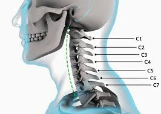
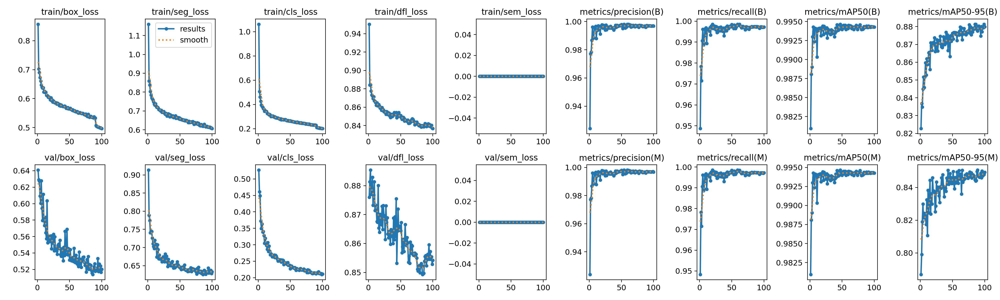
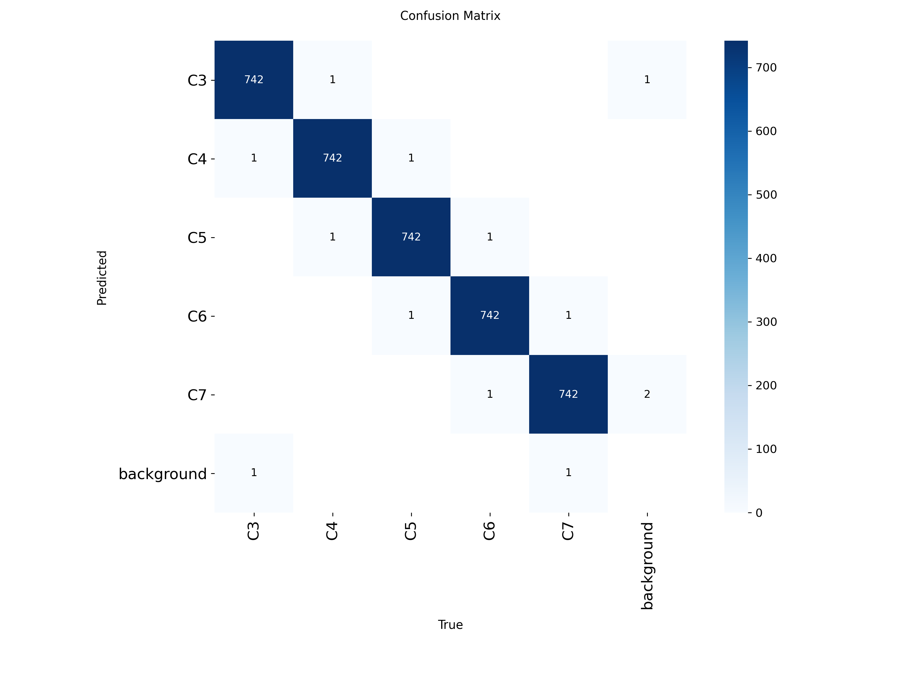
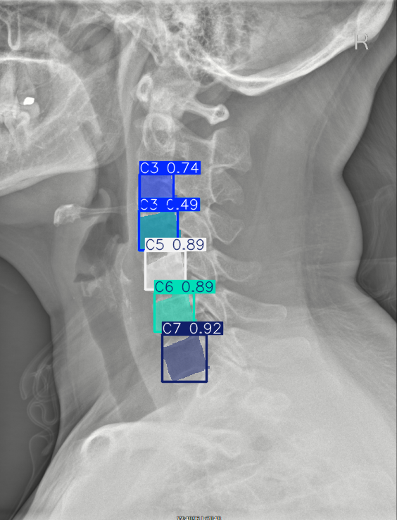
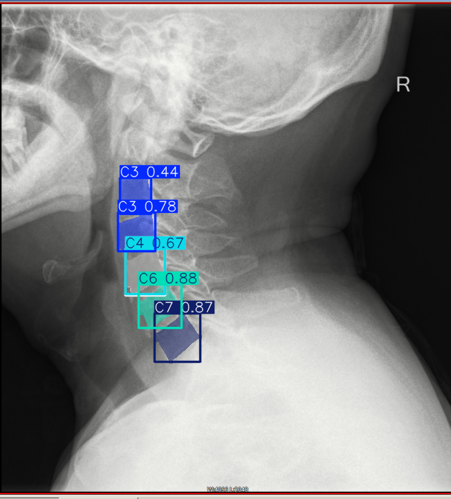
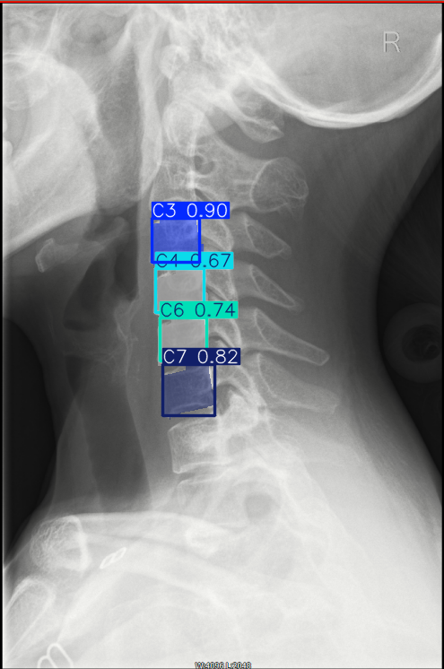

# Automated Cervical Spine Segmentation in 2D Radiographs
---

### 0.1 System Requirements
* **OS:** Windows / Linux / macOS
* **Hardware:** NVIDIA GPU (optional, but recommended) with CUDA support.
* **Software:** Python 3.10+, Conda (recommended).

### 0.2 Environment Installation
```bash
# Create and activate environment
conda create -n spine_env python=3.10 -y
conda activate spine_env

# Install CUDA-enabled PyTorch
pip install torch torchvision torchaudio --index-url [https://download.pytorch.org/whl/cu121](https://download.pytorch.org/whl/cu121)

# Install Project Dependencies
pip install ultralytics opencv-python split-folders
```

### 0.3 Dataset
Install the dataset and unzip it [Cervical Spine X-ray Atlas (CSXA) V3.0](https://www.scidb.cn/en/detail?dataSetId=8e3b3d5e60a348ba961e19d48b881c90)

---

## 1. Project Overview
This project addresses the challenge of automated anatomical identification in medical imaging. Specifically, we developed an **Instance Segmentation** pipeline for cervical vertebrae (C3-C7) using the Cervical Spine X-ray Atlas (CSXA). The goal was to move beyond simple object detection (bounding boxes) to provide precise anatomical outlines (polygons).



## 2. Methodology Selection: YOLOv11-seg vs. TotalSegmentator
Initial research suggested *TotalSegmentator*; however, it was rejected for this project due to:
* **Dimensionality Mismatch:** TotalSegmentator is optimized for 3D volumetric data (CT/MRI). Applying it to 2D X-rays involves significant data "hallucination."
* **Computational Constraints:** YOLOv11-seg offers a superior balance of accuracy and latency on consumer-grade hardware (NVIDIA RTX 3070).

---

## 3. Data Preprocessing: The Engineering Core
Preprocessing was the most critical step in ensuring model convergence.

### 3.1 Vertex Ordering (Clockwise Polygonization)
Standard segmentation models require non-self-intersecting polygons. To solve the problem of geometric "bow-tie" artifacts, we implemented a strict clockwise re-ordering:
1. **Top-Left (TL)** -> 2. **Top-Right (TR)** -> 3. **Bottom-Right (BR)** -> 4. **Bottom-Left (BL)**

### 3.2 Coordinate Normalization
To ensure the model is scale-invariant, raw pixel coordinates $(x, y)$ were converted to normalized values $[0, 1]$ relative to the image dimensions $(W, H)$:
$$x_{norm} = \frac{x}{W}, \quad y_{norm} = \frac{y}{H}$$

### 3.3 Data Partitioning (70/15/15 Split)
We implemented a 3-way partition to ensure scientific validity:
* **Training (70%):** Core learning set.
* **Validation (15%):** Used for hyperparameter tuning and 'best.pt' weight selection.
* **Testing (15%):** An "Unseen" dataset used only once to provide an unbiased evaluation.

---

## 4. The Training Process
### 4.1 Transfer Learning & Optimization
We utilized **Transfer Learning** from the `yolo11s-seg` pre-trained weights. This allowed the model to leverage existing knowledge of universal visual features (edges/textures) while specializing in spinal anatomy.

* **Early Stopping:** We set a `patience` of 20 epochs. This ensures that the training stops as soon as the model begins to **Overfit** (memorizing training data instead of learning general patterns).

### 4.2 Training Metrics Visualization


| epoch | metrics/precision(B) | metrics/recall(B) | metrics/mAP50(B) | metrics/mAP50-95(B) |
|------:|---------------------:|------------------:|-----------------:|--------------------:|
| 1     | 0.92416              | 0.94869           | 0.98092          | 0.82272             |
| 2     | 0.97719              | 0.9783            | 0.98808          | 0.83676             |
| ...   | ...                  | ...               | ...              | ...                 |
| 93    | 0.99697              | 0.99657           | 0.99428          | 0.87874             |
| 94    | 0.99703              | 0.99697           | 0.99425          | 0.87477             |
| 95    | 0.99696              | 0.99731           | 0.99434          | 0.8801              |
| 96    | 0.99683              | 0.99732           | 0.99431          | 0.87716             |
| 97    | 0.9969               | 0.99715           | 0.99431          | 0.87976             |
| 98    | 0.99694              | 0.99727           | 0.99433          | 0.87929             |
| 99    | 0.99708              | 0.99707           | 0.99428          | 0.88138             |
| 100   | 0.99684              | 0.99727           | 0.99428          | 0.87986             |

---

## 5. Crucial Evaluation Metrics
We evaluated the model using the following mathematical foundations:

1. **Intersection over Union (IoU):**
   $$IoU = \frac{|A \cap B|}{|A \cup B|}$$
   Measures the spatial overlap between predicted ($A$) and ground truth ($B$).

2. **mAP50-95:**
   The "Gold Standard" metric, averaging precision across multiple IoU thresholds (0.5 to 0.95). High scores here indicate superior "boundary fidelity" (how well the mask matches the bone's edge).

---

## 6. Qualitative Error Analysis (Failure Mode Discovery)
Despite achieving a **mAP50 of 0.996**, qualitative analysis of the test set revealed specific failure modes. Analyzing these "mistakes" provides insight into the model's logic:

### 6.1 Failure Mode: Ordinal Assignment Errors





In those images the model correctly identified 5 vertebral bodies but mislabeled their sequence (e.g., predicting two C3s).
* **Cause:** Morphological similarity. C3-C6 look nearly identical to a pixel-based model.
* **Interpretation:** The model is an excellent "Feature Detector" but lacks "Anatomical Sequence Awareness."

### 6.2 Failure Mode: Obscuration & Noise
In cases where the mandible (jawbone) or high shoulders overlapped with the spine, the model's confidence dropped (e.g., $Conf < 0.50$). This indicates that image noise from overlapping anatomy remains the primary challenge for 2D radiographs.

---

## 7. Conclusion & Future Work
The project successfully demonstrated that a correctly engineered 2D segmentation pipeline is highly effective for spinal analysis.
**Future Work:** To improve the model, we propose adding a **"Sequence Correction" Layer** in post-processing to ensure ordinal consistency (C3 must always be above C4), and utilizing **Hard Example Mining** to retrain the model on the specific error cases identified in this report.

---

## 8. Additional resources
Metrics & Math: [Dive into Deep Learning (CV Chapter)](https://d2l.ai/chapter_computer-vision/index.html)

Architecture: [Ultralytics YOLOv11 Docs](https://docs.ultralytics.com/)

Medical AI: [DeepLearning.AI - AI in Healthcare](https://pmc.ncbi.nlm.nih.gov/articles/PMC9955430/pdf/diagnostics-13-00688.pdf)

Foundations: CS231n: [Convolutional Neural Networks for Visual Recognition](https://cs231n.stanford.edu/)

U-net: [Fully Automated Segmentation of Cervical Spinal](https://www.mdpi.com/2077-0383/14/19/6994)